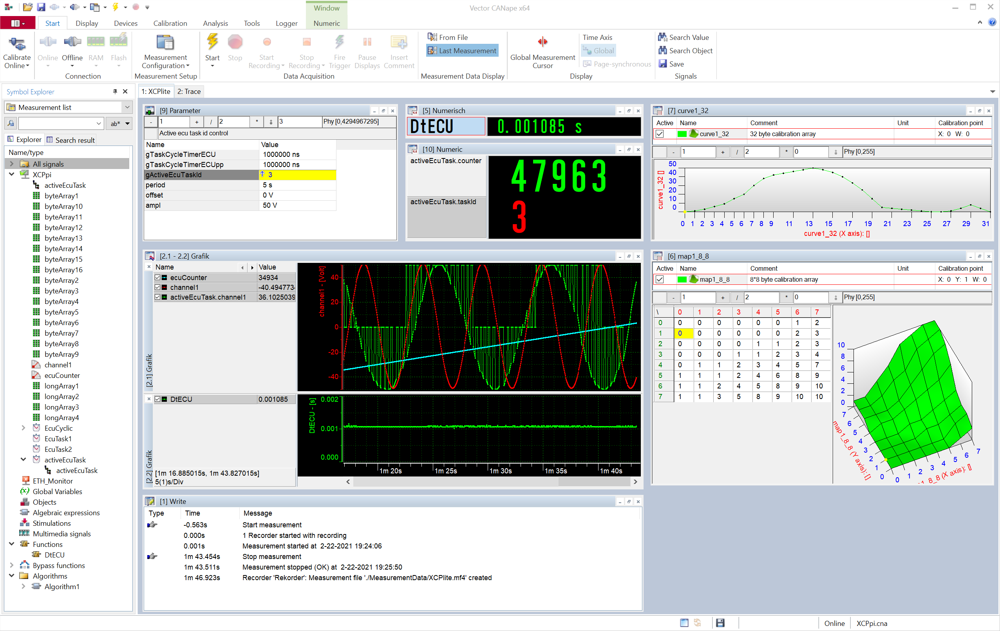

# XCPlite

Copyright 2021 Vector Informatik GmbH

Simple and light implementation of the ASAM XCP Protocol Layer V1.1 (1000 lines of code).

List of restrictions compared to Vectors xcpBasic and xcpProf see below or in source file xcpLite.c.

Optimized for XCP on Ethernet (UDP), multi threaded, no thread lock and zero copy data acquisition.
C and C++ target support.

Achieves up to 80 MByte/s throughput on a Raspberry Pi 4.
3% single thread cpu time in event copy routine for 40MByte/s transfer rate. 
1us measurement timestamp resolution.

Experimental UDP on RAW socket optimization.

No A2L (ASAP2 ECU description) required. 
A A2L with reduced featureset is generated through code instrumentation during runtime on target system and automatically uploaded by XCP.

C and C++ measurement demo variables and code example in ecu.c and ecupp.cpp.
Measure global variables and dynamic instances of structs and classes.

## Code instrumentation:

Only simple code instrumentation needed for event triggering and data copy, event definition and data object definition.

Example:

### Definition:
```
  double channel1;
```

### Initialisation and A2L info generation:

```
  channel1 = 0;
  
  A2lCreateEvent("ECU"); // Create a new event with name "ECU""
  A2lSetEvent("ECU"); // Set event "ECU" to be associated to following measurement definitions
  A2lCreatePhysMeasurement(channel1, 2.0, 1.0, "Volt", "Demo floating point signal"); // Create a new measurement signal "channel1" with linear conversion rule (factor,offset) and unit "Volt"
```


### Measurement data acquisition event:

```
  channel1 += 0.6;
  XcpEvent(1); // Trigger event here, timestamp and copy measurement data
```

Demo visual Studio and CANape project included for Raspberry Pi 4. 




## Configuration options:

All settings and parameters for the XCP protocol handler are in xcp_cfg.h

Basis compile options for the XCPlite demo are:
```
#define XCP_ENABLE_64       // Enable 64 bit platform support, otherwise assume 32 bit plattform
#define XCP_ENABLE_A2L      // Enable A2L creator and A2L upload to host
#define XCP_ENABLE_SO       // Enable measurement and calibration of shared objects
#define XCP_ENABLE_PTP      // Enable PTP synchronized DAQ time stamps
```

## Notes:
if A2L generation and upload disabled, use CANape Linker Map Type ELF extended for a.out format
Compile with -O2
Link with -lrt -lpthread


## XCPlite.c
```
/*****************************************************************************
| File: 
|   xcpLite.c
|
|  Description:   
|    Implementation of the ASAM XCP Protocol Layer V1.4
|    
|    C and C++ target support
|    Lite Version (see feature list and restrictions below)
|
|  Features:
|     - XCP on UDP only
|     - Optimized transmit queue for multi threaded, no thread lock and zero copy data acquisition
|     - Supports DAQ_PACKED_MODE ELEMENT_GROUPED STS_LAST MANDATORY
|     - Supports PTP
|     - Optional integrated UDP stack
|     - Optional integrated A2L generator
|
|  Limitations:
|     - Only XCP on UDP on 32 bit x86 Linux and Windows platforms
|     - 8 bit and 16 bit CPUs are not supported
|     - No misra compliance
|     - Number of events limited to 255
|     - Number of DAQ lists limited to 256
|     - Overall number of ODTs limited to 64K
|     - No jumbo frame support, MAX_DTO < MTU < 1400
|     - Fixed DAQ+ODT 2 byte DTO header
|     - Fixed 32 bit time stamp
|     - Only dynamic DAQ list allocation supported
|     - Resume is not supported
|     - Overload indication by event is not supported
|     - DAQ does not support address extensions and prescaler
|     - DAQ list and event channel prioritization is not supported
|     - ODT optimization not supported
|     - Interleaved communication mode is not supported
|     - Seed & key is not supported
|     - Flash programming is not supported
|     - Calibration pages are not supported
|     - Checksum is not supported
|     - Event messages (SERV_TEXT) are not supported
|     - User commands are not supported
|
|  More features, more transport layer (CAN, FlexRay) and platform support, misra compliance 
|  by the free XCP basic version available from Vector Informatik GmbH at www.vector.com
|
|  Limitations of the XCP basic version:
|     - Stimulation (Bypassing) is not available|         
|     - Bit stimulation is not available
|     - SHORT_DOWNLOAD is not implemented
|     - MODIFY_BITS is not available|
|     - FLASH and EEPROM Programming is not available|         
|     - Block mode for UPLOAD, DOWNLOAD and PROGRAM is not available         
|     - Resume mode is not available|         
|     - Memory write and read protection is not supported         
|     - Checksum calculation with AUTOSAR CRC module is not supported
|        
|     
|  No limitations and full compliance are available with the commercial version 
|  from Vector Informatik GmbH, please contact Vector
|***************************************************************************/
```


